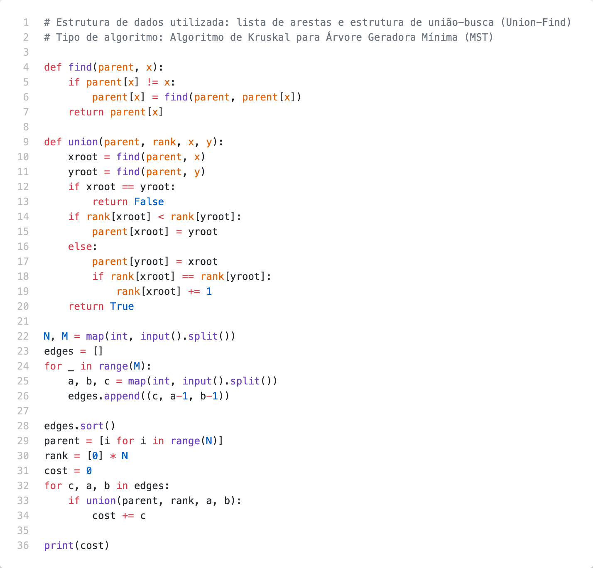

# Problem B

Com a data para o novo formato híbrido aproximando-se, a *** decidiu construir um novo edifício para comportar os  funcionários que passarão a vir mais  vezes  ao  escritório. No projeto de construção deste edifício, existem ao todo N salas de trabalho, conectadas por corredores, de tal forma que é possível trafegar de uma sala para qualquer outra seguindo um caminho entre salas e corredores. Para cada corredor que conecta duas salas, existe um custo Ci para a construção do corredor.

Sua tarefa é determinar qual o menor custo necessário para construir o edifício, dada a configuração do projeto inicial, e a restrição de que na construção final a regra de poder ir de uma sala para outra  qualquer passando por uma sequência de salas e corredores deve ser  mantida.  O  custo  da  construção  de  uma  sala  é  negligível,  apenas  o  custo  da construção dos corredores importa.

## Inputs

A primeira linha da entrada contém dois inteiros, N e M (2 ≤ N ≤ 103 e 1 ≤ M ≤ 105), sendo o  número  de  salas  existentes  no  projeto  do  edifício,  e  o  número  de corredores, respectivamente. As salas são enumeradas de 1 a N.

Cada uma das M linhas a seguir contém três inteiros Ai, Bi e Ci (1 ≤ Ci ≤ 103), indicando que no  projeto  inicial  do  edifício  existe  um  corredor  que  conecta  as  salas  Ai  e  Bi  e  que  seu custo de construção é Ci.

## Outputs

Seu algoritmo deve imprimir uma única linha com um número inteiro, indicando o menor custo possível para a construção do edifício, dadas as restrições impostas.

## Examples

| Exemplo de entrada 1  | Exemplo de saída 1    |
| --------------------- | --------------------- |
| 4 4                   | 60                    |
| 1 2 10                |                       |
| 1 3 40                |                       |
| 2 4 30                |                       |
| 3 4 20                |                       |

| Exemplo de entrada 2  | Exemplo de saída 2    |
| --------------------- | --------------------- |
| 5 6                   |                       |
| 1 2 8                 |                       |
| 2 3 12                |                       |
| 2 4 9                 |                       |
| 2 5 3                 |                       |
| 3 4 5                 |                       |
| 4 5 1                 |                       |

## Code

[Go to code](../codes/B.py)
