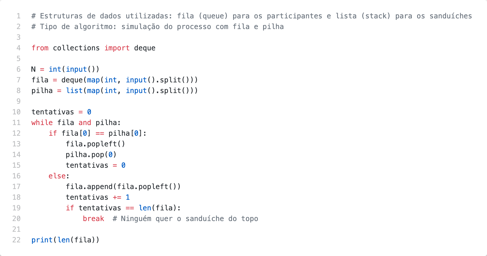

# Problem D

A equipe de RH da *** teve uma ideia de atrair novos talentos e  promoveu um evento para  os  participantes  da  Maratona  de  Programação.  Com  isso,  foram  organizadas palestras, tours pelo Labs, entre outras atividades. E no meio de tudo isso, será feita uma pausa  para  o  lanche,  ou  coffee  break.  Foram  disponibilizadas  várias  opções,  incluindo sanduíches  em  formatos  circulares  e  triangulares,  representados  por  0  e  1, respectivamente.  As  pessoas  que  optarem  pelo  sanduíche,  deverão  formar  uma  fila  e esperar a sua vez. Os sanduíches estão organizados como se fossem uma pilha. A ordem para pegar um sanduíche é a seguinte:

- Se  a  primeira  pessoa  da  fila  optou  pelo  tipo  de  sanduíche  que  está  no  topo  da pilha, ele pega o sanduíche e sai da fila.
- Se não é o sanduíche que ele optou, ele não pega o sanduíche e volta para o final da fila.  

O processo continua até que nenhum dos participantes possa pegar o sanduíche que está
no  topo  da  pilha  e,  com  isso,  não  comer  um  sanduíche.  Sua  tarefa  é  dizer  quantos participantes não conseguiram pegar um sanduíche.

## Inputs

A primeira linha de entrada consiste em um inteiro N (1 <= N <= 100), representando a quantidade de participantes e a quantidade de sanduíches. Na segunda linha, seguem N
inteiros, 0 e 1, separados por espaço, descrevendo a opção do  i-ésimo participante. Na
última linha, seguem N inteiros, também 0 e 1, separados por espaço, descrevendo o j-ésimo tipo de sanduíche na pilha.

Considere que o início da fila é o participante na posição i = 0 e no topo da pilha está o sanduíche na posição j = 0.

## Outputs

A  saída  consiste  em  uma  única  linha  contendo  um  único  inteiro,  com  a  quantidade  de participantes que não conseguiram pegar um sanduíche.

## Examples

| Exemplo de entrada 1  | Exemplo de saída 1    |
| --------------------- | --------------------- |
| 4                     | 0                     |
| 1 1 0 0               |                       |
| 0 1 0 1               |                       |

| Exemplo de entrada 2  | Exemplo de saída 2    |
| --------------------- | --------------------- |
| 6                     | 3                     |
| 1 1 1 0 0 1           |                       |
| 1 0 0 0 1 1           |                       |

## Code

[Go to code](../codes/D.py)
