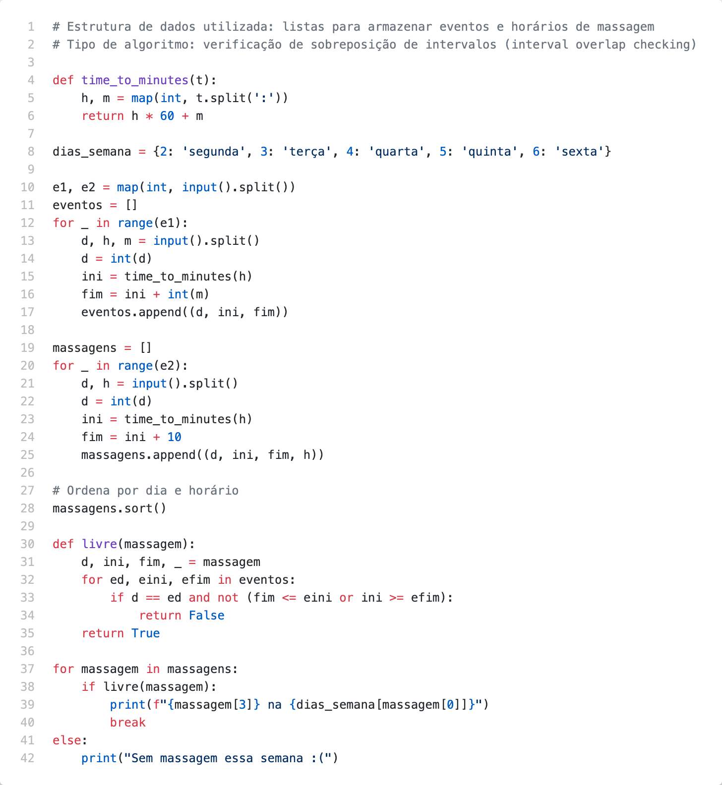

# Problem G

Na  ***  você  pode  agendar  uma  massagem  de  10  minutos  toda  semana.  As  vagas  são limitadas, sendo que o primeiro horário inicia às 14:00 e o último termina às 18:00, de segunda a sexta. A inscrição é disponibilizada semanalmente às 13h da segunda-feira.

Nas  últimas  semanas  têm  sido  difíceis  conseguir  um  horário,  pois  as  vagas  são preenchidas  muito  rapidamente.  Devido  a  isto,  você  precisa  criar  um  programa  para encontrar o primeiro horário disponível, desde que você não tenha outro compromisso na agenda.

## Inputs

A primeira linha contém dois números inteiros e1 e e2 (0 ≤ e1, e2 ≤ 100) representando, respectivamente, o número de eventos da sua agenda pessoal e o número de horários de massagens disponíveis. As próximas e1 linhas são compostas por três informações: dia da semana  d  (2=segunda,  3=terça,  4=quarta,  5=quinta  e  6=sexta),  horário  de  início  h (HH:MM, onde HH=horas e MM=minutos) e a duração em minutos m (15, 30, 60, 90, 120, 180). As próximas e2 linhas são compostas por duas informações: d (dia da semana) e h (horário de início).

## Outputs

Para cada caso de teste, seu programa deve imprimir uma linha única contendo o primeiro horário  da  massagem  e  o  dia  da  semana  disponível  no  padrão  “HH:MM  na dia_da_semana”.  Porém,  caso  não  tenha  disponibilidade,  imprima  a  mensagem  “Sem massagem essa semana :(“.

## Examples

| Exemplo de entrada 1  | Exemplo de saída 1    |
| --------------------- | --------------------- |
| 2 4                   | 17:50 na quinta       |
| 2 15:00 30            |                       |
| 4 14:00 60            |                       |
| 2 15:20               |                       |
| 4 14:40               |                       |
| 5 17:50               |                       |
| 6 16:10               |                       |

| Exemplo de entrada 2  | Exemplo de saída 2            |
| --------------------- | ----------------------------- |
| 1 4                   | Sem massagem essa semana :(   |
| 6 15:00 180           |                               |
| 6 16:20               |                               |
| 6 16:30               |                               |
| 6 17:00               |                               |
| 6 17:10               |                               |

## Code

[Go to code](../codes/G.py)
