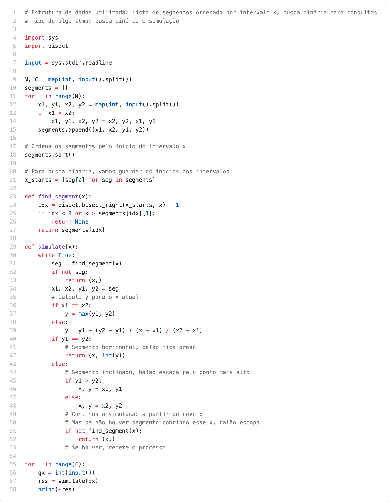

# Problem L

Uma das principais dificuldades de organizar uma Maratona de Programação é recolher os balões que escapam e ficam presos no teto do salão: muitas vezes o contrato com o dono do salão exige que este seja entregue limpo logo após o evento, sob pena de multa. Este ano a organização da Maratona está mais previdente: ela tem o desenho do teto do salão,  e  quer  sua  ajuda  para  determinar  o  que  pode  acontecer  com  um  balão, dependendo da posição no solo onde ele é solto (isto é, se é bloqueado pelo teto ou se escapa para o exterior do salão). O teto do salão é formado por vários planos que, vistos de lado, podem ser descritos por segmentos de reta.

O balão pode ser considerado pontual. Quando um balão toca um segmento do teto que é horizontal, ele fica preso. Quando um balão toca um segmento que é inclinado, o balão desliza até o ponto mais alto do segmento e escapa, podendo escapar completamente do salão  ou  podendo  tocar  em  mais  segmentos.  Não  há  pontos  em  comum  entre  os segmentos que formam o teto. Por exemplo, se o balão for solto nas posições marcadas como a ou b, será bloqueado na posição de coordenadas (2, 5); se o balão for solto na posição marcada como c, será bloqueado na posição de coordenadas (6, 5); e se o balão for solto na posição marcada como d, não será bloqueado e escapará para fora do salão na posição de coordenada x = 7. Escreva um programa que, dada a descrição do teto do salão como segmentos de reta, responde a uma série de consultas sobre a posição final de balões soltos do piso do salão.

## Inputs

A  primeira  linha  da  entrada  contém  dois  inteiros  N  e  C  indicando,  respectivamente,  o
número de segmentos de reta do teto e o número de consultas. Cada uma das N linhas seguintes contém quatro inteiros X1, Y1, X2, Y2, descrevendo um segmento de reta do perfil do teto, com extremos de coordenadas (X1, Y1) e (X2, Y2). Cada uma das C linhas seguintes descreve uma consulta e contém um inteiro X, indicando que a consulta quer determinar o que acontece com um balão solto no ponto de coordenada (X, 0).

RESTRIÇÕES

- 1 ≤ N ≤ 105
- 1 ≤ C ≤ 105
- 0 ≤ X1, X2 ≤ 106 , 0 < Y1, Y2 ≤ 106 , X1 != X2
- não há dois valores de coordenadas x iguais, considerando todos os segmentos.
- 0 ≤ X ≤ 106

## Outputs

Para cada consulta da entrada, seu programa deve imprimir uma única linha. Se o balão escapar do salão, a linha deve conter um único inteiro X, indicando a coordenada x pela qual  o  balão  escapa  do  salão.  Caso  contrário,  a  linha  deve  conter  dois  inteiros  X  e  Y indicando a posição (x, y) em que o balão fica retido no teto.

## Examples

| Exemplo de entrada 1  | Exemplo de saída 1    |
| --------------------- | --------------------- |
| 4 4                   | 2 5                   |
| 0 1 3 3               | 2 5                   |
| 1 5 6 5               | 7                     |
| 5 3 2 4               | 6 5                   |
| 7 4 10 2              |                       |
| 2                     |                       |
| 5                     |                       |
| 8                     |                       |
| 6                     |                       |

| Exemplo de entrada 2  | Exemplo de saída 2    |
| --------------------- | --------------------- |
| 4 3                   | 1                     |
| 1 3 4 2               | 7                     |
| 10 3 7 4              | 8 3                   |
| 2 3 8 3               |                       |
| 3 5 5 4               |                       |
| 4                     |                       |
| 9                     |                       |
| 8                     |                       |

## Code

[Go to code](../codes/L.py)
