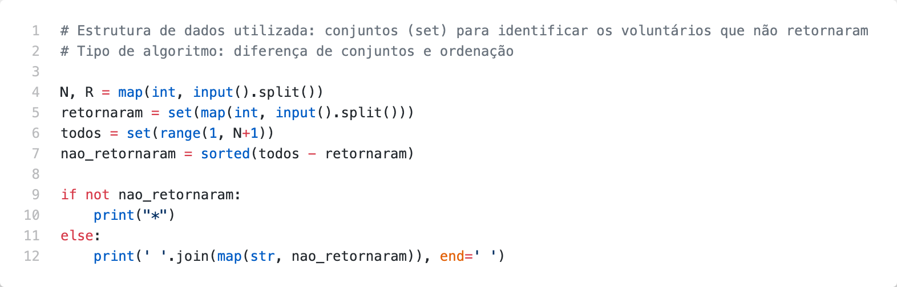

# Problem M

O recente terremoto  em Nlogônia não chegou a  afetar muito as  edificações  da capital, principal  epicentro  do  abalo.  Mas  os  cientistas  detectaram  que  o  principal  dique  de contenção teve um dano significativo na sua parte subterrânea que, se não for consertado rapidamente,  pode  causar  o  seu  desmoronamento,  com  a  consequente  inundação  de toda a capital. O conserto deve ser feito por mergulhadores, a uma grande profundidade, em condições extremamente difíceis e perigosas. Mas como é a sobrevivência da própria cidade que está em jogo, seus moradores acudiram em grande número como voluntários para essa perigosa missão. Como é tradicional em missões perigosas, cada mergulhador recebeu no início do mergulho uma pequena placa com um número de identificação. Ao terminar o mergulho, os voluntários devolviam a placa de identificação, colocando-a em um repositório. O dique voltou a ser seguro, mas aparentemente alguns voluntários não voltaram  do  mergulho.  Você  foi  contratado  para  a  penosa  tarefa  de,  dadas  as  placas colocadas  no  repositório,  determinar  quais  voluntários  perderam  a  vida  salvando  a cidade.

## Inputs

A entrada é composta de duas linhas. A primeira linha contém dois inteiros N e R (1 ≤ R ≤ N ≤ 104), indicando respectivamente o número de voluntários que mergulhou e o número de voluntários que retornou do mergulho. Os voluntários são identificados por números de  1  a  N.  A  segunda  linha  da  entrada  contém  R  inteiros,  indicando  os  voluntários  que retornaram do mergulho (ao menos um voluntário retorna do mergulho).

## Outputs

Seu programa deve produzir uma única linha, contendo os identificadores dos voluntários que não retornaram do mergulho, na ordem crescente de suas identificações. Deixe um espaço  em  branco  após  cada  identificador  (inclusive,  após  o  último  identificador).  Se todos os voluntários retornaram do mergulho, imprima apenas o caractere “*” (asterisco).

## Examples

| Exemplo de entrada 1  | Exemplo de saída 1    |
| --------------------- | --------------------- |
| 5 3                   | 2 4                   |
| 3 1 5                 |                       |

| Exemplo de entrada 2  | Exemplo de saída 2    |
| --------------------- | --------------------- |
| 6 6                   | *                     |
| 6 1 3 2 5 4           |                       |

## Code

[Go to code](../codes/M.py)
