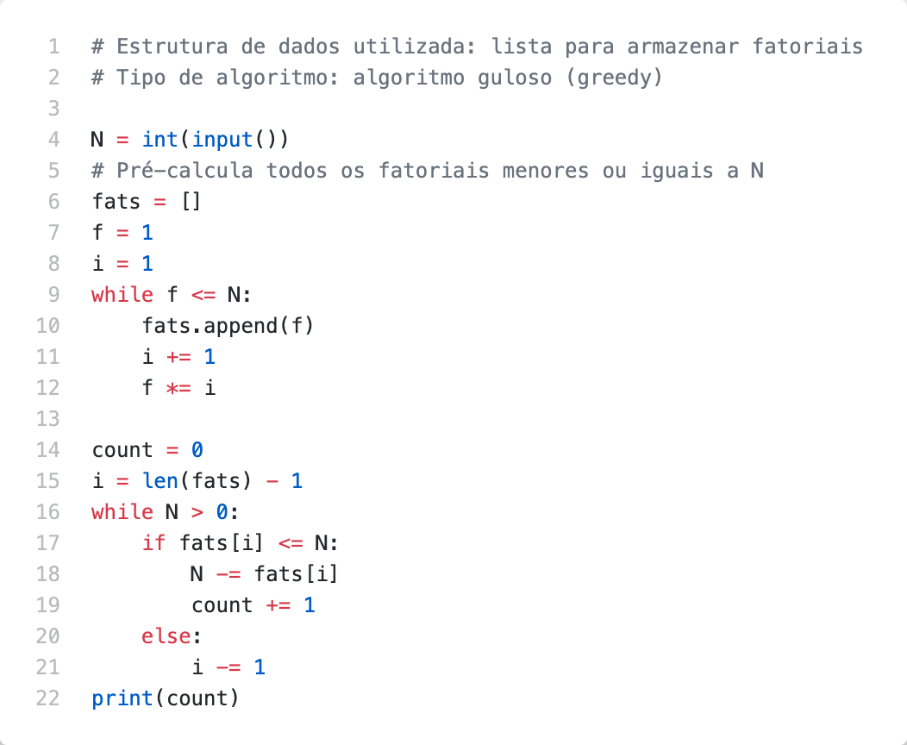

# Problem T

O fatorial de um número inteiro positivo N, denotado por N!, é definido como o produto dos inteiros positivos menores do que ou iguais a N. Por exemplo 4! = 4 × 3 × 2 × 1 = 24. Dado um inteiro positivo N, você deve escrever um programa para determinar o menor número k tal que N = a1! + a2! + . . . + ak!, onde cada ai, para 1 ≤ i ≤ k, é um número inteiro positivo. Por exemplo, para N = 10 a resposta é 3, pois é possível escrever N como a soma de três  números  fatoriais: 10 = 3! +  2! + 2!. Para  N  =  25  a resposta  é  2, pois  é  possível escrever N como a soma de dois números fatoriais: 25 = 4! + 1!.

## Inputs

A entrada consiste de uma única linha que contém um inteiro N (1 ≤ N ≤ 105).

## Outputs

Seu  programa  deve  produzir  uma  única  linha  com  um  inteiro  representando  a  menor quantidade de números fatoriais cuja soma é igual ao valor de N.

## Examples

| Exemplo de entrada 1  | Exemplo de saída 1    |
| --------------------- | --------------------- |
| 10                    | 3                     |

| Exemplo de entrada 2  | Exemplo de saída 2    |
| --------------------- | --------------------- |
| 25                    | 2                     |

## Code

[Go to code](../codes/T.py)
