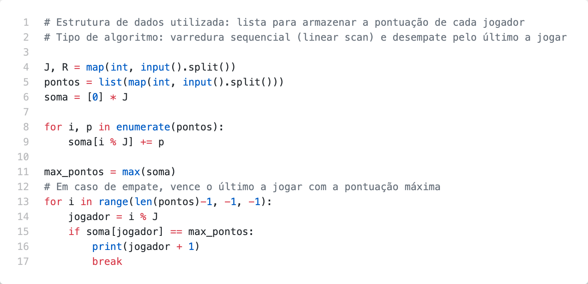

# Problem U

Um jogo de estratégia, com J jogadores, é jogado em volta de uma mesa. O primeiro a jogar  é  o  jogador  1,  o  segundo  a  jogar  é  o  jogador  2  e  assim  por  diante.  Uma  vez completada uma rodada, novamente o jogador 1 faz sua jogada e a ordem dos jogadores se repete. A cada jogada, um jogador garante uma certa quantidade de Pontos de Vitória. A pontuação de cada jogador consiste na soma dos Pontos de Vitória de cada uma das suas  jogadas.  Dado  o  número  de  jogadores,  o  número  de  rodadas  e  uma  lista representando  os  Pontos  de  Vitória  na  ordem  em  que  foram  obtidos,  você  deve determinar  qual  é  o  jogador  vencedor.  Caso  mais  de  um  jogador  obtenha  a  pontuação máxima, o jogador com pontuação máxima que tiver jogado por último é o vencedor.

## Inputs

A entrada consiste de duas linhas. A primeira linha contém dois inteiros J e R, o número de jogadores e de rodadas respectivamente (1 ≤ J, R ≤ 500). A segunda linha contém J × R inteiros, correspondentes aos Pontos de Vitória em cada uma das jogadas feitas, na ordem em que aconteceram. Os Pontos de Vitória obtidos em cada jogada serão sempre inteiros entre 0 e 100, inclusive.

## Outputs

Seu  programa  deve  produzir  uma  única  linha,  contendo  o  inteiro  correspondente  ao jogador vencedor.

## Examples

| Exemplo de entrada 1  | Exemplo de saída 1    |
| --------------------- | --------------------- |
| 3 3                   | 3                     |
| 1 1 1 1 2 2 2 3 3     |                       |

| Exemplo de entrada 2  | Exemplo de saída 2    |
| --------------------- | --------------------- |
| 2 3                   | 1                     |
| 0 0 1 0 2 0           |                       |

## Code

[Go to code](../codes/U.py)
